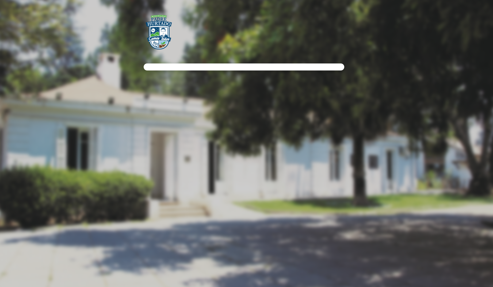
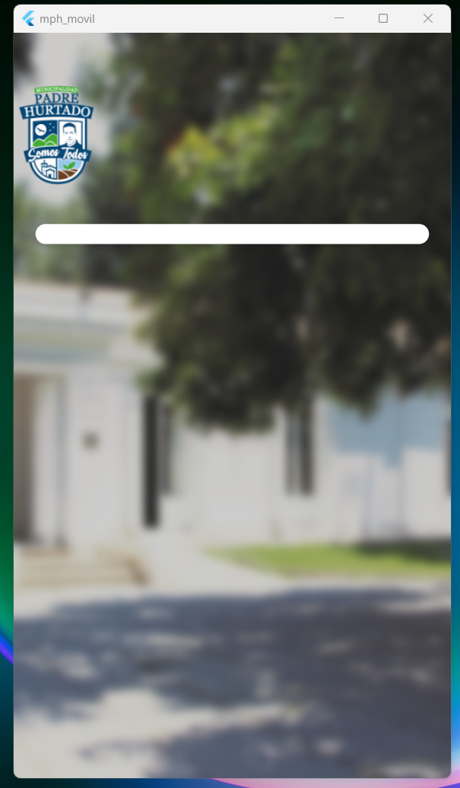
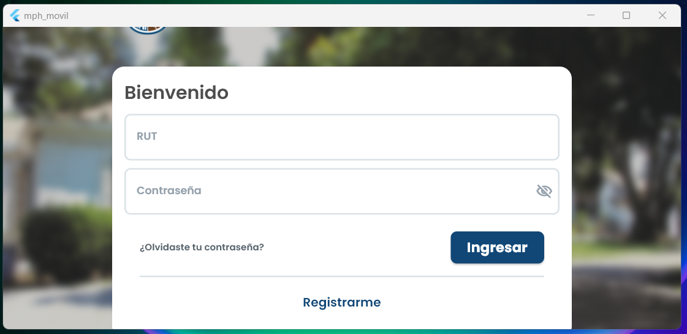

# UI Scaffold Image With Centered Container

## Descripción

Pantalla completa con imagen de la municipalidad. Al centro se encuentra el logo y un contenedor blanco, que representará el contenido de la propiedad *child*.

- El logo y el contenedor están encerrados en un *SizedBox* que les da un limite de ancho máximo de 600px.
- El logo y el contenedor están encerrados en un *SingleChildScrollView* que permite desplazarse en la pantalla si el alto máximo de estos elementos es mayor que el de la pantalla. El *Scrollbar* es invisible

## Capturas

### Widget en pantalla completa

|  |
| ------------------------------------------------------------ |
| *Widget en pantalla completa*                                |

### Widget en tamaño celular (vertical)

|  |
| ------------------------------------------------------------ |
| *Widget en tamaño celular (vertical)*                       |

### Widget con contenido, tamaño celular (horizontal)

|  |
| ------------------------------------------------------------ |
| *Widget con contenido, tamaño celular (horizontal)*          |
| El *Scrollbar* no está visible, pero aún se puede desplazar el contenido de forma vertical. |